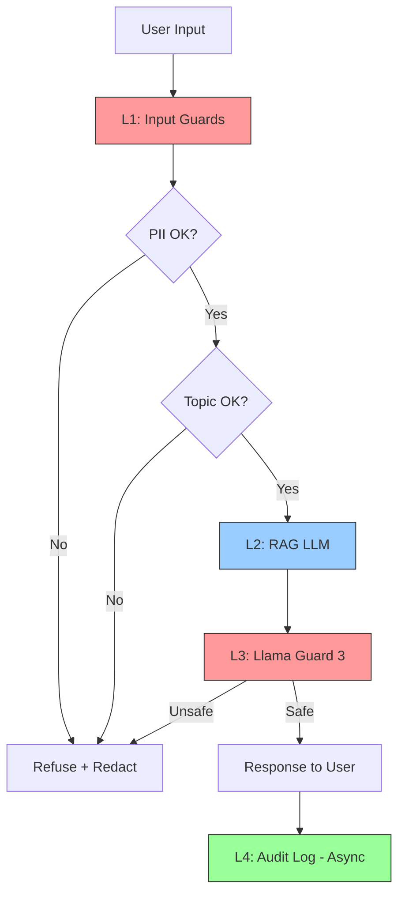

# Production RAG Blueprint — Phase D

## Section 1: SLO Definition (2 điểm)

| Metric | Target | Alert Threshold | Severity |
|--------|--------|-----------------|----------|
| Faithfulness | ≥ 0.85 | < 0.80 for 30 min | P2 |
| Answer Relevancy | ≥ 0.80 | < 0.75 for 30 min | P2 |
| Context Precision | ≥ 0.70 | < 0.65 for 1h | P3 |
| Context Recall | ≥ 0.75 | < 0.70 for 1h | P3 |
| P95 Latency (with guardrails) | < 2.5s | > 3s for 5 min | P1 |
| Guardrail Detection Rate | ≥ 90% | < 85% | P2 |
| False Positive Rate | < 5% | > 10% | P2 |

**Error Budget:** 0.5% downtime/month = ~3.6 hrs

---

## Section 2: Architecture Diagram (3 điểm)



### Defense-in-depth 4 Layers

| Layer | Components | Latency Budget | Purpose |
|-------|-----------|----------------|---------|
| **L1: Input** | Presidio PII + VN Regex + Topic Validator | <50ms (P95) | Sanitize + scope check |
| **L2: LLM** | RAG Pipeline (BM25 + Dense + Rerank + GPT-4o-mini) | <2000ms | Generation |
| **L3: Output** | Llama Guard 3 (Groq API) / OpenAI Moderation | <100ms (P95) | Safety check |
| **L4: Audit** | Async logging (fire-and-forget) | N/A | Compliance |

### Data Flow

```
User Input
    ↓
[L1] Input Layer (parallel)
├─ PII Redaction (Presidio + VN regex)     ~15ms
├─ Topic Validator (LLM zero-shot)         ~200ms
└─ Injection Detection (keyword filter)     ~1ms
    ↓
[L2] LLM Call (RAG pipeline)
├─ BM25 Search                              ~20ms
├─ Dense Search (Qdrant)                    ~50ms
├─ RRF Fusion                               ~5ms
├─ Cross-Encoder Rerank                    ~200ms
└─ GPT-4o-mini Generation                 ~1500ms
    ↓
[L3] Output Layer
├─ Llama Guard 3 (Groq API)                ~80ms
└─ PII Redaction (output)                   ~10ms
    ↓
[L4] Audit Log (async)
    ↓
Response to User
```

---

## Section 3: Alert Playbook (3 điểm)

### Incident 1: Faithfulness drops < 0.80

| Item | Detail |
|------|--------|
| **Severity** | P2 |
| **Detection** | Continuous eval alert — RAGAS nightly run |
| **Likely causes** | 1. Retriever returning bad chunks (check CP) |
| | 2. LLM prompt drift (check version) |
| | 3. Document corpus updated without re-index |
| **Investigation steps** | 1. Check CP score same timeframe — if also down, retrieval issue |
| | 2. Check prompt version — diff vs last week |
| | 3. Check document update log |
| **Resolution** | - If retrieval: re-index or tune retriever |
| | - If prompt drift: rollback prompt |
| | - If corpus: re-run indexing pipeline |
| **SLO impact** | Track TTD (time to detect) and TTR (time to recover) |

### Incident 2: PII Leak in Response

| Item | Detail |
|------|--------|
| **Severity** | P1 (Critical) |
| **Detection** | Output guardrail PII check flags entity |
| **Likely causes** | 1. New PII pattern not in regex |
| | 2. Presidio model misses Vietnamese entities |
| | 3. PII in document corpus not pre-cleaned |
| **Investigation steps** | 1. Check which PII type leaked (CCCD, phone, email?) |
| | 2. Verify regex patterns cover the format |
| | 3. Check if PII exists in source documents |
| **Resolution** | - Immediately redact response |
| | - Add missing regex pattern |
| | - Clean PII from document corpus |
| **SLO impact** | Any leak = SLO violation, notify compliance within 1hr |

### Incident 3: P95 Latency > 3s

| Item | Detail |
|------|--------|
| **Severity** | P1 |
| **Detection** | Latency monitor (P95 rolling 5-min window) |
| **Likely causes** | 1. LLM API rate limiting (OpenAI) |
| | 2. Qdrant performance degradation |
| | 3. Embedding model OOM on GPU |
| **Investigation steps** | 1. Check per-layer timings (L1/L2/L3) |
| | 2. If L2 high → check Qdrant health, API response times |
| | 3. If L1/L3 high → check Presidio/Llama Guard |
| **Resolution** | - Scale horizontally if load-related |
| | - Switch to cached embeddings if GPU issue |
| | - Downgrade to smaller model if sustained |
| **SLO impact** | Users experience slow responses, potential abandonment |

---

## Section 4: Cost Analysis (2 điểm)

### Monthly Cost Estimate (assumption: 100k queries/month)

| Component | Unit Cost | Volume | Monthly Cost |
|-----------|-----------|--------|-------------|
| RAG generation (GPT-4o-mini) | $0.001/query | 100k | $100 |
| RAGAS continuous eval (1% sample) | $0.01/query | 1k | $10 |
| LLM Judge (Tier 2, gpt-4o-mini) | $0.001/query | 10k | $10 |
| LLM Judge (Tier 3, gpt-4o) | $0.05/query | 1k | $50 |
| Presidio (self-hosted) | — | 100k | $0 |
| Llama Guard 3 (Groq API free tier) | — | 100k | $0 |
| Llama Guard 3 (self-hosted GPU) | $0.30/hr | 720hr | $216 |
| **Total (API option)** | | | **$170** |
| **Total (self-hosted GPU)** | | | **$386** |

### Cost Optimization Opportunities

1. **Tier judging:** Current $60/mo → optimized $30/mo by routing simple queries to GPT-4o-mini
2. **Sampling strategy:** 1% eval sample may be too low — adaptive sampling based on query complexity
3. **Llama Guard:** Use Groq free tier for low-volume (<10k/day), switch to self-hosted for production scale
4. **Caching:** Cache embeddings + frequent queries → reduce LLM calls by ~30%
5. **Batch processing:** Batch RAGAS evaluation nightly instead of real-time → reduce API costs

### Break-even Analysis

| Scale | API Cost | Self-hosted Cost | Recommendation |
|-------|----------|-----------------|----------------|
| <10k/mo | $17 | $250+ | API (Groq + OpenAI) |
| 10k-50k/mo | $85 | $300 | API |
| 50k-200k/mo | $340 | $400 | Hybrid |
| >200k/mo | $680+ | $450 | Self-hosted |
